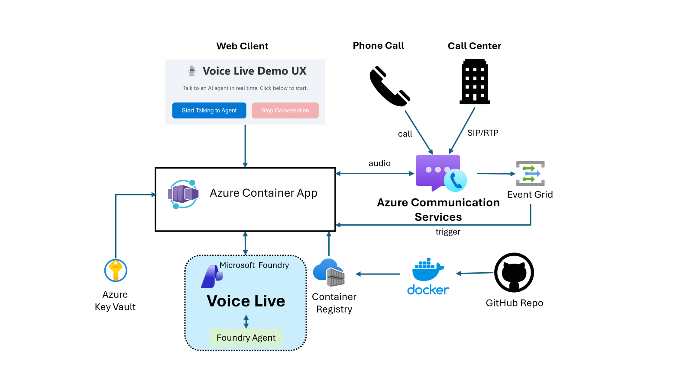
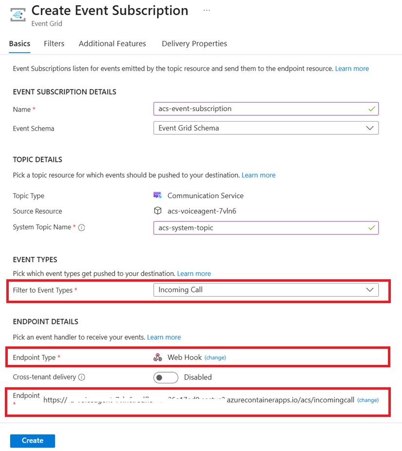

# easyJet Customer Support Voice Agent

A real-time voice agent for easyJet customer support, built on the [Azure Voice Live API](https://learn.microsoft.com/azure/ai-services/speech-service/voice-live) and [Azure AI Foundry Agent Service](https://learn.microsoft.com/azure/ai-services/agents/). Customers can speak naturally to get help with flight bookings, baggage issues, refunds, claims, and more — via a web browser or a phone call through Azure Communication Services.

Based on the [Call Center Voice Agent Accelerator](https://github.com/Azure-Samples/call-center-voice-agent-accelerator) template.

<div align="center">

[**Features**](#features) | [**Architecture**](#architecture) | [**Prerequisites**](#prerequisites) | [**Deployment**](#deployment) | [**Create the Foundry Agent**](#create-the-foundry-agent) | [**Testing**](#testing-the-agent) | [**Local Development**](#local-development) | [**Ambient Scenes**](#-ambient-scenes) | [**Clean-up**](#resource-clean-up)

</div>

<br/>

## Features

- **Foundry Agent with tools** — Uses a GPT-4.1 agent deployed in Azure AI Foundry with:
  - **File Search** over easyJet policies PDF, flight data, and template forms
  - **WorkIQ Mail MCP** tool for sending email confirmations
  - **Status Update** function tool that pushes live visual cards to the customer's browser
- **Voice Live API** — Low-latency speech-to-speech (ASR + LLM + TTS) in a single WebSocket, using the `en-GB-Ollie:DragonHDLatestNeural` voice
- **Two client modes** — Web browser (microphone/speaker) and Azure Communication Services (ACS) phone calls
- **Ambient Scenes** (optional) — Realistic background audio presets (office, call center, or custom WAV files)
- **One-click Azure deployment** via `azd up` (Container Apps, Container Registry, AI Services, ACS, Key Vault, Foundry Project)

### What the agent can do

| Capability | Data source |
|---|---|
| Answer policy questions (baggage, accessibility, easyJet Plus, etc.) | `data/easyJetPolicies.pdf` |
| Search flights London → Milan, Barcelona, Marrakech, Amsterdam | `data/flightsData.md` |
| Complete forms: delayed/damaged baggage, hold luggage, cancellation/refund, compensation claim, easyJet Plus, special assistance | `data/forms.md` |
| Send email confirmations after booking or form completion | WorkIQ Mail MCP tool |
| Push live status cards to the customer's browser | `send_status_update` function tool |

### Architecture

||
|---|

<br/>

## Prerequisites

- An [Azure subscription](https://azure.microsoft.com/free/) with permissions to create resource groups and resources
- [Azure CLI](https://learn.microsoft.com/cli/azure/what-is-azure-cli) (`az`)
- [Azure Developer CLI](https://learn.microsoft.com/azure/developer/azure-developer-cli/overview) (`azd`) >= 1.14.0
- [Python](https://www.python.org/about/gettingstarted/) >= 3.9
- [UV](https://docs.astral.sh/uv/getting-started/installation/) (`uv`)
- Optionally [Docker](https://www.docker.com/get-started/) (`docker`)

### Region availability

The Bicep templates currently allow **East US 2** and **Sweden Central**. Sweden Central is recommended for best AI Foundry model availability.

### Costs

| Product | Description | Pricing |
|---|---|---|
| [Azure Speech Voice Live](https://learn.microsoft.com/azure/ai-services/speech-service/voice-live/) | Low-latency speech-to-speech | [Pricing](https://azure.microsoft.com/pricing/details/cognitive-services/speech-services/) |
| [Azure AI Foundry](https://learn.microsoft.com/azure/ai-foundry/) | Agent hosting, GPT-4.1 model | [Pricing](https://azure.microsoft.com/pricing/details/cognitive-services/openai-service/) |
| [Azure Communication Services](https://learn.microsoft.com/azure/communication-services/overview) | Telephony / call automation | [Pricing](https://azure.microsoft.com/pricing/details/communication-services/) |
| [Azure Container Apps](https://learn.microsoft.com/azure/container-apps/) | Hosts the server application | [Pricing](https://azure.microsoft.com/pricing/details/container-apps/) |
| [Azure Container Registry](https://learn.microsoft.com/azure/container-registry/) | Stores container images | [Pricing](https://azure.microsoft.com/pricing/details/container-registry/) |
| [Azure Key Vault](https://learn.microsoft.com/azure/key-vault/) | Stores ACS connection string | [Pricing](https://azure.microsoft.com/pricing/details/key-vault/) |

Use the [Azure pricing calculator](https://azure.microsoft.com/pricing/calculator) for estimates.

<br/>

## Deployment

### 1. Clone the repository

```bash
git clone <your-repo-url>
cd call-center-voice-agent-accelerator
```

### 2. Login to Azure

```bash
azd auth login
```

### 3. Provision and deploy

```bash
azd up
```

You will be prompted for:
- An **environment name** (e.g. `easyjet-voice-agent`)
- An **Azure subscription**
- A **location** (`eastus2` or `swedencentral` — Sweden Central recommended)

This provisions all Azure resources (AI Services, ACS, Container Apps, Container Registry, Key Vault, Storage, Foundry Project) and deploys the server application.

> `azd` will also set up a local Python virtual environment and install dependencies.

### 4. Note the outputs

After `azd up` completes, note the **Container App URL** printed in the terminal. You'll also see `FOUNDRY_PROJECT_ENDPOINT` in the outputs — you'll need this for the next step.

<br/>

## Create the Foundry Agent

After infrastructure is provisioned, create the AI Foundry agent that powers the voice experience.

### 1. Install the agent dependencies

```bash
pip install azure-ai-projects azure-identity azure-ai-voicelive
```

### 2. Set the Foundry project endpoint

If `azd` didn't already populate your `.env` file, set it manually:

```bash
# Get it from azd outputs or the Azure Portal -> Foundry Project -> Overview
export FOUNDRY_PROJECT_ENDPOINT="https://<your-region>.api.azureml.ms/agents/discovery/workspaces/<project-name>"
```

On Windows PowerShell:
```powershell
$env:FOUNDRY_PROJECT_ENDPOINT = "https://<your-region>.api.azureml.ms/agents/discovery/workspaces/<project-name>"
```

### 3. Check your azd environment variables

Run the below to check that you have `FOUNDRY_AGENT_NAME`, `FOUNDRY_AGENT_VERSION`, and `FOUNDRY_PROJECT_NAME` set.
```bash
azd env get-values
```

If `FOUNDRY_AGENT_NAME` and `FOUNDRY_AGENT_VERSION` are not set, run the following commands in terminal.
```bash
azd env set FOUNDRY_AGENT_NAME "easyjet-customer-support-agent"
azd env set FOUNDRY_AGENT_VERSION "1"
```

Then run `azd up` again.
```bash
azd up
```

### 4. Run the agent creation script

```bash
python agent/create_agent.py
```

This will:
- Upload `data/easyJetPolicies.pdf`, `data/flightsData.md`, and `data/forms.md` to a vector store
- Configure File Search, WorkIQ Mail MCP, and the `send_status_update` function tool
- Create or replace the `easyjet-customer-support-agent` in your Foundry project
- Save `FOUNDRY_AGENT_NAME`, `FOUNDRY_AGENT_VERSION`, and `FOUNDRY_PROJECT_NAME` to `.env`

### 4. Update email addresses

The sample data files and agent instructions reference a default email for confirmations. Update these to your own email:

- `data/forms.md` — sample contact emails in template forms
- `agent/create_agent.py` — the agent instructions tell the model to send email confirmations "to the customer"; if you want a hardcoded recipient for testing, edit the `AGENT_INSTRUCTIONS` string

### 5. Deploy the updated configuration

```bash
azd deploy
```

<br/>

## Testing the Agent

### Web Client (Quick Test)

1. Go to the [Azure Portal](https://portal.azure.com) → your **Resource Group** → **Container App**
2. Copy the **Application URL** from the Overview page
3. Open the URL in your browser — the easyJet support page loads
4. Click **Start Talking to Agent** and speak using your microphone
5. The agent will greet you and respond to questions about flights, baggage, policies, etc.
6. Status cards appear on the right panel as the agent processes your requests

> This web client is intended for testing purposes only. Use the ACS client below for production-like call flow testing.

### ACS Phone Client (Call Center Scenario)

#### 1. Set up the incoming call webhook

1. In your resource group, open the **Communication Services** resource
2. Go to **Events** → **+ Event Subscription**
3. Configure:
   - **Event Type**: `IncomingCall`
   - **Endpoint Type**: `Web Hook`
   - **Endpoint URL**: `https://<your-container-app-url>/acs/incomingcall`



#### 2. Get a phone number

[Get a phone number](https://learn.microsoft.com/azure/communication-services/quickstarts/telephony/get-phone-number?tabs=windows&pivots=platform-azp-new) for your ACS resource if you haven't already.

#### 3. Call the agent

Dial the ACS number. Your call connects to the real-time voice agent.

<br/>

## Local Development

After deploying infrastructure with `azd up`, you can run the server locally.

### 1. Create a `.env` file

Copy the sample and fill in your values:

```bash
cp server/.env-sample.txt .env
```

Required variables (see `server/.env-sample.txt` for the full list):

| Variable | Description |
|---|---|
| `AZURE_VOICE_LIVE_ENDPOINT` | AI Services endpoint (from Azure Portal or `azd` outputs) |
| `ACS_CONNECTION_STRING` | ACS connection string (from Azure Portal) |
| `FOUNDRY_PROJECT_ENDPOINT` | Foundry project endpoint |
| `FOUNDRY_AGENT_NAME` | Agent name (set by `agent/create_agent.py`) |
| `FOUNDRY_AGENT_VERSION` | Agent version (set by `agent/create_agent.py`) |
| `FOUNDRY_PROJECT_NAME` | Project name (set by `agent/create_agent.py`) |

### 2. Run the server

```bash
cd server
uv run server.py
```

Open [http://127.0.0.1:8000](http://127.0.0.1:8000) in your browser.

### Run with Docker (alternative)

```bash
cd server
docker build -t easyjet-voice-agent .
docker run --env-file ../.env -p 8000:8000 -it easyjet-voice-agent
```

### Test with ACS locally (DevTunnels)

To receive phone calls locally, expose your server via [Azure Dev Tunnels](https://learn.microsoft.com/azure/developer/dev-tunnels/overview):

```bash
devtunnel login
devtunnel create --allow-anonymous
devtunnel port create -p 8000
devtunnel host
```

Set `ACS_DEV_TUNNEL=https://<your-tunnel>.devtunnels.ms:8000` in your `.env` file, then configure the ACS Event Subscription to point to `https://<your-tunnel>.devtunnels.ms:8000/acs/incomingcall`.

<br/>

## Optional Features

### 🎧 Ambient Scenes

Add realistic background audio to simulate call center environments. Works for both web and phone clients.

| Preset | Description |
|---|---|
| `none` | Disabled (default) |
| `office` | Quiet office ambient |
| `call_center` | Busy call center background |
| *custom* | Your own WAV files |

**Enable it:**

```bash
# Local — add to .env
AMBIENT_PRESET=call_center

# Azure deployment
azd env set AMBIENT_PRESET call_center
azd up
```

**Custom audio files:** Place a WAV file (24kHz, 16-bit mono, 30–60 seconds) in `server/app/audio/`, register it in `server/app/handler/ambient_mixer.py` under `PRESETS`, and set `AMBIENT_PRESET` to your preset name.

**Volume:** Controlled by `_ambient_gain` in `server/app/handler/ambient_mixer.py` (default: `0.20`). Range: `0.05` (very quiet) to `0.30` (noticeable).

<br/>

## Project Structure

```
call-center-voice-agent-accelerator/
├── agent/
│   └── create_agent.py          # Creates the Foundry agent with tools
├── data/
│   ├── easyJetPolicies.pdf      # Policy knowledge base
│   ├── flightsData.md           # Sample flight data (London routes)
│   └── forms.md                 # Template forms for customer requests
├── infra/                       # Bicep IaC modules
│   ├── main.bicep
│   └── modules/
├── server/
│   ├── server.py                # Quart web server (entry point)
│   ├── Dockerfile
│   ├── pyproject.toml
│   ├── .env-sample.txt          # Environment variable template
│   ├── app/
│   │   ├── audio/               # Ambient audio WAV files
│   │   └── handler/
│   │       ├── acs_event_handler.py   # ACS incoming call / callback handling
│   │       ├── acs_media_handler.py   # Voice Live SDK WebSocket + audio streaming
│   │       └── ambient_mixer.py       # DSP-based ambient audio mixing
│   └── static/                  # Web frontend (HTML/CSS/JS)
├── azure.yaml                   # azd project configuration
└── .env                         # Environment variables (gitignored)
```

<br/>

## Resource Clean-up

```bash
azd down
```

To redeploy to a different region, delete the `.azure` directory before running `azd up` again.

<br/>

## Security Considerations

- ACS does not currently support Managed Identity. The ACS connection string is stored in **Azure Key Vault** and injected into the Container App via its secret URI.
- The server uses a **User Assigned Managed Identity** for authentication to AI Services and the Foundry project — no API keys are stored in the container.
- The `.env` file is gitignored to prevent accidental credential exposure.

<br/>

## Resources

- [Azure Voice Live API](https://learn.microsoft.com/azure/ai-services/speech-service/voice-live)
- [Azure AI Foundry Agent Service](https://learn.microsoft.com/azure/ai-services/agents/)
- [Azure Communication Services — Call Automation](https://learn.microsoft.com/azure/communication-services/concepts/call-automation/call-automation)
- [Voice Live + Foundry Agents quickstart](https://learn.microsoft.com/azure/ai-services/speech-service/voice-live-agents-quickstart)
- [Azure Speech Service](https://learn.microsoft.com/azure/ai-services/speech-service/)

<br/>

## Trademarks

This project may contain trademarks or logos for projects, products, or services. Authorized use of Microsoft trademarks or logos is subject to and must follow [Microsoft's Trademark & Brand Guidelines](https://www.microsoft.com/en-us/legal/intellectualproperty/trademarks/usage/general). Use of Microsoft trademarks or logos in modified versions of this project must not cause confusion or imply Microsoft sponsorship. Any use of third-party trademarks or logos are subject to those third-party's policies.
